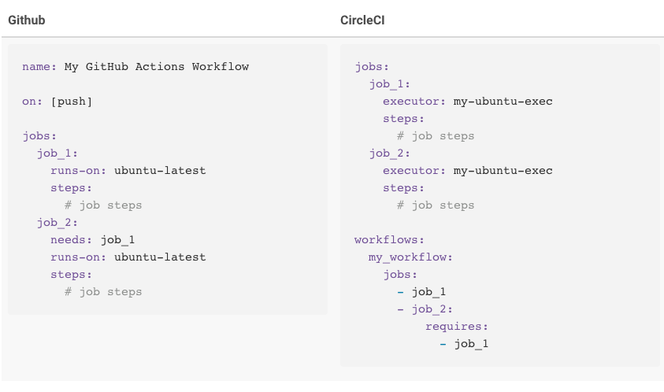
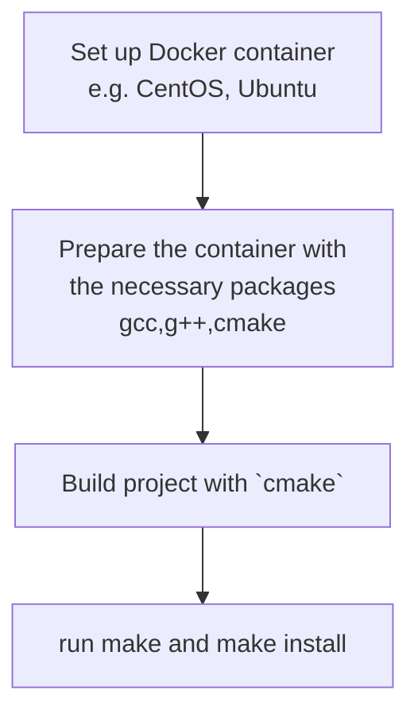

# CI/CD Documentation

This section is dedicated to giving useful resources (from actual documentation or various dev communities).

## CircleCI

In order to push branches for building on CircleCI, a workflow needs to be configured on the actual project repository. A `.cricleci` directory should be created on the main tree, with a `config.yml` file inside.

* [getting started with CircleCI](https://circleci.com/docs/2.0/migrating-from-github/#section=getting-started) - there is also a nice comparison with GitHub Actions.
* [Official documentation](https://circleci.com/docs/2.0/)
* [Orbs, Jobs, Steps, and Workflows](https://circleci.com/docs/2.0/jobs-steps/#section=getting-started)
* [Sample 2.0 config.yml Files](https://circleci.com/docs/2.0/sample-config/)

Other useful blog posts from CircleCI website.

* [How to build a CI/CD pipeline with Docker](https://circleci.com/blog/build-cicd-piplines-using-docker/)
* [15 testing methods all developers should know](https://circleci.com/blog/testing-methods-all-developers-should-know/)
* [More about configuring CircleCI](https://circleci.com/docs/2.0/getting-started/#section=getting-started)
* [Setting up enviroment variables](https://circleci.com/docs/2.0/env-vars/#example-configuration-of-environment-variables)

### Sources




The config file should contain the build information: number of jobs to be pipelined, type of job (e.g. Docker container), and the commands to be executed on each job.

Simplest way is to develop a pipeline for uploading the project to a Docker container with a specific OS (e.g. **Debian**, **CentOS**, **Ubuntu**). If the specific container is chosen from the official images (from Docker Hub), then a barebone image will be installed with no additional packages. As a result, some prerequisites should be installed before building and running the project.

## Sample Configuration with Concurrent Jobs

Following is a sample 2.0 `.circleci/config.yml` file.

```yml
version: 2
jobs:
  build:
    docker:
      - image: circleci/<language>:<version TAG>
    steps:
      - checkout
      - run: <command>
  test:
    docker:
      - image: circleci/<language>:<version TAG>
    steps:
      - checkout
      - run: <command>
workflows:
  version: 2
  build_and_test:
    jobs:
      - build
      - test
```

> This example shows a concurrent job workflow where the build and test jobs run concurrently to save time. Refer to the Workflows document for complete details about orchestrating job runs with concurrent, sequential, and manual approval workflows.

### For a C++ project

[This](http://gueepo.me/blog/simple-ci-for-cpp/) is a great example for setting up a CircleCI pipeline of a project developed with CMake. The setup process for a Docker container is nicely explained here. Installing updates and getting sudo ready for the OS is also described.

1. Update the OS
2. Install the sudo rights
3. Get `g++/gcc` and `cmake` from the OS-specific app repository (like `apt` or `yum`)
4. Build with CMake
5. Test with predefined scripts or pure executable.
6. *Optional* - make artifacts for later use.



## Developing on multiplatforms

While deploying a project to multiple containers, a lot of issues were encountered while building the pipelines (from the given configuration file in CircleCI). [This page](issues.md) describes in detail potential issues and how to fix them.

Most of them are related to:

* General OS for their specific docker images

* Compiler issues (also might be different per each platform)

* CMake issues (required flags and INSTALL commands) 

## Cmake

Some information [here](cmake.md).

## GitHub Actions

There are some useful *starter* workflows available (e.g. [here](https://github.com/actions/starter-workflows/pull/47#issuecomment-537846624)) and there is also a dedicated repository to a workflow with the help of GitHub Actions (see [here](https://github.com/basavyr/effective-journey)).

Check `github/` directory for some recipes on getting a workflow up and ready.