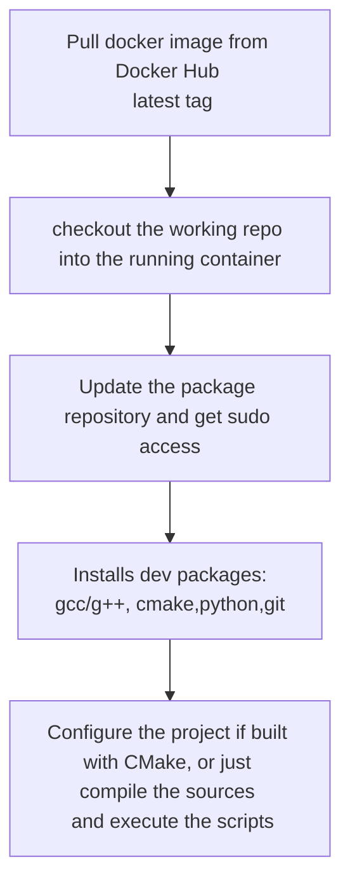

# CircleCI & General CI/CD workflow 

## A guide in solving issues for building development projects

## Running the `ubuntu:latest` image

### Fail of cmake install

While trying to build a `C++` project on the official Ubuntu image privided by Docker hub, some issues with installing the `cmake` package from `apt` package repository were encountered.

**During installation of cmake, the prompt kept asking for region and timezone**

Building couldn't be done, since cmake was not able to finish installing.

**Solution**: The command to install a package without any prompts is `apt-get install -y`, however if that doesn't work, there is a solution which involves changing *environment variables*. It is possible to do that right before image is started (in the config file) or in the actual commands after the container is up and running.

* https://serverfault.com/questions/683605/docker-container-time-timezone-will-not-reflect-changes?rq=1
  * This is a post where a guide on setting the timezone correctly is described.

* https://serverfault.com/questions/949991/how-to-install-tzdata-on-a-ubuntu-docker-image?newreg=d939b07235a74480a0dd051eecc34583
  * In this post, a configure recipe is described, which allows one to set the environment variables and install `tzdata` (a package that helps in setting up proper timezone).

```bash
RUN DEBIAN_FRONTEND="noninteractive" apt-get -y install tzdata
```

Setting up the frontend to *noninteractive* will make possible to silently install `cmake` on the Ubuntu container.

* https://github.com/moby/moby/issues/27988
  * This github issue shows another way of properly making the container to install app packages wihout any prompts.

In order to be 100% sure every package gets installed successfully,  config script for `ubuntu:latest` should always have this commands:

```yml
- run:
    name: "set env vars again"
    command: |
      echo 'debconf debconf/frontend select Noninteractive' debconf-set-selections
      echo export DEBIAN_FRONTEND=noninteractive >> $BASH_ENV
      source $BASH_ENV
```

## Running cmake `INSTALL`  command in the configuration process

Unlike macOS, some other UNIX based Linux distributions need some different commands in the `CMakeLists.txt` files for properly installing all the executables and libraries.

**Issue**: cmake process failed at building project, due to complaints with regard to installing the **libs** and the **bins** (libraries and binaries).

**Solution**: use a proper destination command in the building recipe.

```cmake
install(TARGETS a_library LIBRARY DESTINATION lib)
install(TARGETS an_executable RUNTIME DESTINATION bin)
```

> This works for Ubuntu, Centos and Debian without issues.

## Running the cmake *build* command fails

After the required packages are installed, the next step is to properly build the project, which should be made with the command:

```bash
cmake -D CMAKE_INSTALL_PREFIX=/path ..
```

**Observation**: the build command is done in the `/build` directory, which sould be created after everything is installed on the container.

However, on `ubuntu:latest` and `centos:latest`, the cmake process fails because it can't find the actual C and C++ compilers (CC and CXX). 

**Solution**: just make sure the g++ compiler is found in the system's path (`which g++` should show somethign like `/usr/bin/g++`) and pass the compilers to the actual `CC` and `CXX` flags on the command line like this:

```bash
CC=gcc CXX=g++ cmake -D CMAKE_INSTALL_PREFIX=../tarball/build/ .. && make && make install"
```

Notice that in the command above, the project is also installed on the system.

## Installing packages in *silent mode*

### Ubuntu:latest container 

When setting up a CircleCI pipeline, running the project inside a Ubuntu based container, especially in the official image from Docker Hub (e.q. `ubuntu:tag=latest`), it is possible to generate a **silent install** for every package desired, after updating the container to the latest packages with `apt-get update`.

This is very useful when some install packages require user input - such thing is impossible on a cloud CI/CD pipeline like CircleCI.

**Solution**: 

* After configuring the docker image, doing the checkout of the current repository and setting up the `$DEBIAN_FRONTEND` environment variable, the [following command](https://github.com/SeleniumHQ/docker-selenium/blob/3f59708d29248752f1ba5c4b64297fb5c8fd9262/NodeChrome/Dockerfile#L23) should be added into the config script:

```yml
   - run:
          name: install qqy
          command: apt-get update -qqy && apt-get -qqy install
```

However, it is recommended to properly update the system beforehand, with the following command:

```yml
  - run:
          name: Update and install sudo
          command: "apt-get update && apt-get install -y sudo &&  rm -rf /var/lib/apt/lists/* "
```

This will also give sudo-access and make sure latest updates are present on the container.

## Getting sudo access

### Centos

Commands like `sudo yum install` are not possible when trying to work with the official Centos image from Docker Hub.

### Debian and Ubuntu

Thanks to a [great post](http://gueepo.me/blog/simple-ci-for-cpp/) that describes how to properly setup a pipeline on a Docker container.

The command for getting sudo right up and ready is:

```yml
- run:
    name: Installing updates and SUDO
    command: "apt-get update && apt-get install -y sudo && rm -rf /var/lib/apt/lists/* && uname -a"
```

## Installing development tools

On centos, g++ is only available with `dng groupinstall "Development Tools"`

Debian and Ubuntu work with `apt-get install -y g++ gcc`

### Python 

In order to get a Python development environment, simply install **Python2** and **Python3** via the command line, with the os-based package repository (e.g. `apt`, `yum`)

```yml
- run:
    name: Install the required packages
    command: "apt-get install -yqq g++ python python3"
```

## Getting a fast development pipeline ready for CI/CD in CircleCI

There are some example config files in `circle` directory for setting up pipelines on three major platforms:

* CentOS - [always latest](circleci/centos.yml)
* Ubuntu - [always latest](circleci/ubuntu.yml)
* Debian - [always latest](circleci/debian.yml)

The scripts for them are as follow:



## @rpath - running the executable from the project tree

On some operating systems (containers) there were issues with running the project's executable from `/bin`, because of missing libraries.

```cmake
#this alows use to run the executables made after the `make install` command is executed by the user
set(CMAKE_MACOSX_RPATH 1)
# the RPATH to be used when installing
set(CMAKE_INSTALL_RPATH "${CMAKE_INSTALL_PREFIX}/lib")
```

With these commands, the executable is running fine from the project tree, finding the necessary libraries inside the `/lib` directory automatically.

There is a lot of documentation involved in setting proper RPATH, and [this](https://github.com/basavyr/macos-devel-issues) repository will treat it in detail.

However, a list of sources is shown below:

1. https://stackoverflow.com/questions/47697761/cmake-run-time-error-dyld-library-not-loaded-for-dynamically-linked-resource/47699417#47699417 - Explains how RPATH works in general within CMAKE
2. https://blog.krzyzanowskim.com/2018/12/05/rpath-what/ - @rpath what?
3. https://gitlab.kitware.com/cmake/community/-/wikis/doc/cmake/RPATH-handling - great documentation on creating projects with cmake that will make the executable to be able to run 
4. https://stackoverflow.com/questions/30398238/cmake-rpath-not-working-could-not-find-shared-object-file - CMAKE RPATH not working - could not find shared object file
5. https://stackoverflow.com/questions/32469953/why-is-cmake-designed-so-that-it-removes-runtime-path-when-installing/32470070#32470070 - great answer on how to keep the rpath intact
6. https://stackoverflow.com/questions/43551483/how-to-set-rpath-in-cmake/43551534 - **this command helped setting up cmake installer properly on macos**
7. https://cmake.org/pipermail/cmake/2013-July/055274.html
8. https://cmake.org/pipermail/cmake/2011-April/043826.html
9. https://cmake.org/pipermail/cmake/2018-November/068554.html
10. https://stackoverflow.com/questions/40146437/how-to-set-multiple-rpath-directories-using-cmake-on-macos - How to set multiple RPATH directories using CMake on MacOS

Since the rpath is chosen for OSX, the executable is able to run from the project install, finding the shared libraries that it needs.